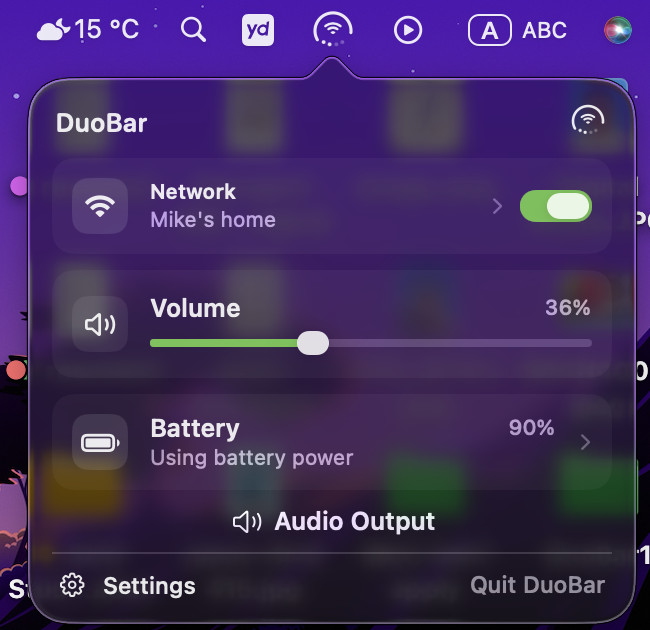

# DuoBar

[English](README.md) | [简体中文](README.zh-CN.md) | [Русский](README.ru.md) | [Українська](README.uk.md)

Индикатор в стиле iPhone Duo для строки меню macOS: батарея, сеть и громкость в одном значке.

[**Скачать DuoBar 1.2.1**](https://github.com/Mikeli7666/DuoBar/releases/download/v1.2.1/DuoBar-1.2.1.dmg) · [Все версии](https://github.com/Mikeli7666/DuoBar/releases) · [English](README.md)

DuoBar 1.2.1 (сборка 5) · macOS 13 Ventura или новее · Apple Silicon и Intel · Universal 2

  

## Скачивание и установка

### Шаг 1. Скачать DuoBar

Нажмите «Скачать DuoBar 1.2.1» выше. Браузер загрузит файл:

`DuoBar-1.2.1.dmg`

Обычному пользователю нужен только этот DMG. Не скачивайте:

- Source code (zip)
- Source code (tar.gz)

Это исходники для разработчиков, а не установщик.

Если вы открыли страницу [Releases](https://github.com/Mikeli7666/DuoBar/releases):

1. Найдите последнюю версию **DuoBar 1.2.1**.
2. Внизу страницы откройте список **Assets**.
3. Скачайте **DuoBar-1.2.1.dmg**.

### Шаг 2. Установить

1. Дважды щёлкните `DuoBar-1.2.1.dmg`.
2. Finder откроет окно образа диска.
3. Перетащите `DuoBar.app` в папку **Программы / Applications**.
4. Дождитесь окончания копирования.
5. Откройте «Программы».
6. Запустите DuoBar.

### Шаг 3. Первый запуск

DuoBar 1.2.1 подписан Developer ID и прошёл нотариальную проверку Apple. Для обычной установки не нужно отключать Gatekeeper или SIP, использовать Terminal, `sudo` или `xattr`.

DuoBar живёт в строке меню и **не появляется в Dock**. После запуска смотрите на верхний край экрана — значок DuoBar будет там.

## Зачем доступ к геолокации?

macOS может запросить доступ к геолокации, чтобы показать имя текущей сети Wi‑Fi (SSID). DuoBar использует это разрешение только через публичные API и только ради имени сети.

Если отказать:

- DuoBar продолжит работать
- батарея не пострадает
- громкость не пострадает
- базовое состояние сети по-прежнему видно
- имя Wi‑Fi может отображаться как «Имя сети недоступно»

## Как пользоваться

DuoBar постоянно в строке меню. Три части значка:

- **Внешняя дуга** → батарея / Adaptive Ring
- **Центр** → Wi‑Fi, Ethernet или другое состояние сети
- **Четыре точки снизу** → громкость

Нажмите на значок, чтобы открыть панель:

- Сеть
- Громкость
- Аккумулятор
- Аудиовыход
- Настройки
- Выйти из DuoBar

В настройках можно включить **Open on Hover** (открывать при наведении).

  

## Возможности

- Battery Ring: заряд, состояние зарядки, динамическая молния и опциональная цветовая индикация
- Adaptive Ring: на настольных Mac — яркость, а при необходимости автоматически нагрузку на CPU, память или тепловое состояние
- Скруглённый индикатор Wi‑Fi и визуальный язык Duo
- Имя текущей сети Wi‑Fi (SSID)
- Включение и выключение Wi‑Fi прямо в DuoBar
- Состояния Wi‑Fi, Ethernet и офлайн
- Громкость, слайдер и отключение звука (если устройство это поддерживает)
- Сведения об аудиовыходе
- Краткое отображение AirPods / наушников при подключении
- Open on Hover (открывать при наведении)
- Настраиваемый размер значка в строке меню
- English, русский, украинский, 简体中文, 繁體中文

## Системные требования

- macOS 13 Ventura или новее
- Apple Silicon
- Intel Mac
- Universal 2

## Безопасность и приватность

DuoBar 1.2.1 подписан Apple Developer ID и прошёл нотариальную проверку Apple. Приложение не распространяется через Mac App Store.

Состояние системы обрабатывается локально:

- нет аналитики и трекинга
- нет телеметрии
- состояние системы никуда не загружается
- нет посторонних сетевых запросов

DuoBar — независимый проект и не связан с Apple Inc.

## Если что-то не так

Напишите в [GitHub Issues](https://github.com/Mikeli7666/DuoBar/issues).

Если вы не технарь, достаточно:

- модели Mac
- версии macOS
- версии DuoBar
- описания проблемы
- скриншота, если удобно

Технические логи не обязательны.

## Целостность загрузки

SHA-256 официального DMG DuoBar 1.2.1:

`ac4c3acbe4569c2ccc984ff52c007c208a557abb96b32764a8ec6eeab79f0235`

Обычному пользователю это проверять не нужно. Строка для тех, кто хочет убедиться, что файл не подменили.

## Совместимость

- macOS 13.0 или новее
- Apple Silicon или Intel, Universal 2
- Сборка и работы по совместимости/надёжности выполнены с Xcode 27 и SDK macOS 27 при сохранении поддержки macOS 13+. Это не заявление о завершённом тестировании macOS 27 на реальном оборудовании.

В панели DuoBar доступны переключение аудиовыхода и быстрые переходы к настройкам Network, Battery и Sound.

## Лицензия

DuoBar распространяется под [MIT License](LICENSE).
