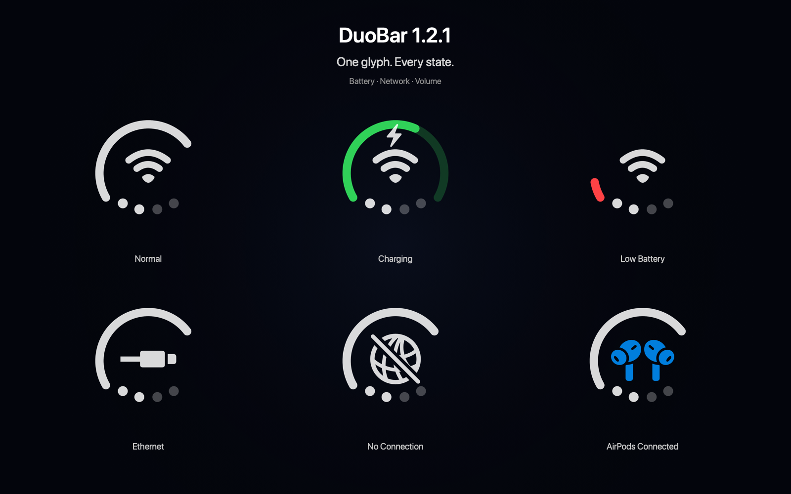

# DuoBar

[English](README.md) | [简体中文](README.zh-CN.md) | [Русский](README.ru.md) | [Українська](README.uk.md) | [ไทย](README.th.md)

Компактний індикатор для рядка меню macOS: акумулятор, мережа й гучність в одному значку.

[Завантажити DuoBar 1.2.1](https://github.com/Mikeli7666/DuoBar/releases/tag/v1.2.1) · [Усі версії](https://github.com/Mikeli7666/DuoBar/releases) · [Повідомити про помилку](https://github.com/Mikeli7666/DuoBar/issues)

DuoBar 1.2.1 (збірка 5) · macOS 13+ · Apple Silicon та Intel · Universal 2 · Безкоштовний проєкт із відкритим кодом

  

## 📥 Встановлення для початківців

1. Відкрийте [реліз DuoBar 1.2.1](https://github.com/Mikeli7666/DuoBar/releases/tag/v1.2.1).
2. У розділі **Assets** завантажте **DuoBar-1.2.1.dmg**. Не завантажуйте `Source code (zip)` або `Source code (tar.gz)` — це вихідний код.
3. Двічі клацніть файл **DuoBar-1.2.1.dmg** і перетягніть **DuoBar.app** до **Applications / Програми**.
4. Відкрийте «Програми» та запустіть DuoBar. Це утиліта рядка меню, тому зазвичай вона не з’являється в Dock.

DuoBar 1.2.1 підписано Developer ID та нотаризовано Apple. Не потрібно вимикати Gatekeeper або SIP, використовувати Terminal, `sudo` чи `xattr`.

## Дозвіл геолокації та Wi‑Fi

Дозвіл «Геолокація» потрібен лише для відображення назви поточної Wi‑Fi мережі (SSID) через CoreWLAN. Відмова може приховати SSID, але базовий стан мережі працюватиме. DuoBar не відстежує та не передає фізичне місцезнаходження.

## Можливості

- Battery Ring: рівень акумулятора, заряджання, динамічна блискавка та необов’язкове кольорове кодування.
- Adaptive Ring на настільних Mac: яскравість, а за потреби CPU, пам’ять або температура.
- Network: Wi‑Fi, Ethernet, офлайн-стан, SSID і публічний перемикач Wi‑Fi.
- Гучність: чотири крапки, повзунок, вимкнення/увімкнення звуку та вибір аудіовиходу.
- Тимчасове відображення AirPods/навушників, Open on Hover і регулювання розміру значка.
- Швидкі переходи до налаштувань Network, Battery і Sound.
- English, 简体中文, 繁體中文, русский та українська.

  

  

## Системні вимоги та сумісність

- macOS 13.0 або новіша
- Apple Silicon або Intel, Universal 2
- Збірку та роботи з сумісності/надійності виконано з Xcode 27 і SDK macOS 27 зі збереженням підтримки macOS 13+. Це не є заявою про завершене тестування macOS 27 на реальному обладнанні.

## Безпека, обмеження та ліцензія

Системний стан обробляється локально: немає аналітики, відстеження, бекенду, телеметрії чи сторонніх мережевих запитів. DuoBar не сканує найближчі Wi‑Fi мережі, не підключається до них і не створює пару з Bluetooth-пристроями. Деякі зовнішні аудіопристрої не підтримують програмне керування гучністю.

SHA-256 офіційного DMG:

`ac4c3acbe4569c2ccc984ff52c007c208a557abb96b32764a8ec6eeab79f0235`

DuoBar поширюється за [MIT License](LICENSE).
